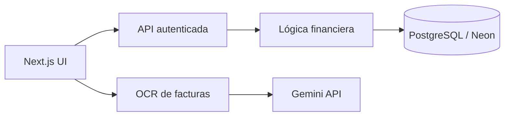

# RutaSaldo

> Controla cómo se mueve tu dinero entre bancos, billeteras, tarjetas y deudas sin contar dos veces las transferencias.

RutaSaldo es una PWA de finanzas personales orientada inicialmente a Colombia y Latinoamérica. Su objetivo es mostrar cuánto dinero está realmente disponible después de considerar cuentas, tarjetas, transferencias, deudas y próximos pagos.

## Estado actual

Última revisión: **31 de julio de 2026**.

### Producción

- Aplicación desplegada en Vercel.
- PostgreSQL administrado en Neon.
- Autenticación con Google mediante Auth.js.
- Workspace privado y aislamiento de datos por usuario.
- API financiera autenticada y sin caché pública.
- Interfaz responsive y manifiesto PWA.

### Funciones disponibles

- Crear cuentas bancarias, billeteras y efectivo.
- Crear tarjetas de crédito mediante un modelo híbrido de cuentas.
- Registrar ingresos y gastos.
- Registrar transferencias entre cuentas propias.
- Pagar tarjetas mediante transferencias, sin duplicar el gasto original.
- Categorías financieras.
- Dashboard con ingresos, gastos, dinero disponible, deuda de tarjetas y patrimonio neto.
- Historial ordenado por fecha y hora de creación, mostrando primero lo más reciente.
- Centro interno de notificaciones financieras.
- Alertas por fecha próxima de pago y utilización alta del cupo.
- OCR de facturas con Gemini, revisión editable y confirmación manual antes de guardar.
- Reintentos, fallback y manejo específico de errores temporales del proveedor de IA.

## Reglas financieras implementadas

- Los importes se almacenan como enteros; no se usa `float` para dinero.
- Una transferencia crea una relación y dos movimientos enlazados.
- Las transferencias no se incluyen en ingresos ni gastos.
- En el historial se muestra una sola representación de cada transferencia.
- Una compra hecha con tarjeta se registra como gasto y aumenta la deuda.
- Un pago hacia una tarjeta se registra como transferencia y reduce la deuda.
- Las tarjetas viven en `accounts` con tipo `credit_card`.
- `credit_card_details` almacena cupo, día de corte, día de pago, últimos cuatro dígitos y tasa.
- El saldo de las cuentas se reconstruye desde el saldo inicial y el historial de movimientos.
- Las operaciones sensibles se ejecutan dentro de transacciones PostgreSQL.

## Estado por fases

### Fase 1 — Fundamentos: completada

- [x] Autenticación.
- [x] Workspaces privados.
- [x] Cuentas y saldos iniciales.
- [x] Ingresos, gastos y categorías.
- [x] Dashboard básico.
- [x] Persistencia en PostgreSQL.
- [x] PWA responsive.

### Fase 2 — Movimiento real del dinero: en ejecución

- [x] Transferencias enlazadas.
- [x] Transferencias excluidas de ingresos y gastos.
- [x] Tarjetas de crédito.
- [x] Cupo, corte, pago, últimos cuatro dígitos y tasa.
- [x] Pagos de tarjeta sin duplicar gastos.
- [x] Deuda de tarjetas y patrimonio neto en el dashboard.
- [x] Alertas básicas de tarjeta.
- [ ] Conciliación manual de dos movimientos existentes como transferencia.
- [ ] Compras a una o varias cuotas.
- [ ] Calendario y estado de cuotas.
- [ ] Deudas y créditos externos.
- [ ] Próximos pagos persistidos y visibles en el resumen.
- [ ] Pruebas de integración para compras, pagos, transferencias, cuotas y deudas.

### Fase 3 — Planeación: pendiente

- [ ] Presupuestos.
- [ ] Quincenas y ciclos de ingreso personalizados.
- [ ] Bolsillos y metas.
- [ ] Disponible real y disponible diario.
- [ ] Movimientos recurrentes.

### Fase 4 — Automatización: iniciada parcialmente

- [ ] Importación CSV.
- [ ] Reglas automáticas de categorización.
- [ ] Detección automática de duplicados.
- [x] OCR de facturas.
- [ ] Automatizaciones con n8n.
- [ ] Asistente financiero con IA.

## Orden de implementación para cerrar la Fase 2

La Fase 2 se cerrará en este orden para conservar consistencia contable:

1. **Compras a cuotas:** plan de cuotas enlazado a una compra original, sin registrar el gasto varias veces.
2. **Próximos pagos:** calendario derivado de tarjetas, cuotas y deudas persistidas.
3. **Deudas externas:** saldo, tasa, cuota, vencimiento y estado.
4. **Conciliación manual:** convertir dos movimientos compatibles en una transferencia enlazada.
5. **Pruebas financieras:** verificar que ningún flujo duplique ingresos, gastos o deuda.

## Referencias de producto y dominio

La implementación es propia. Los siguientes proyectos se usan para estudiar patrones y comportamiento, no para copiar código:

| Proyecto | Referencia principal |
|---|---|
| [Actual Budget](https://github.com/actualbudget/actual) | Transferencias, conciliación, recurrencias y experiencia local-first |
| [Firefly III](https://github.com/firefly-iii/firefly-iii) | Modelo financiero, cuentas, transacciones, pasivos y API |
| [Sure](https://github.com/we-promise/sure) | Activos, pasivos, patrimonio y presentación del dashboard |
| [Cashew](https://github.com/jameskokoska/Cashew) | Registro rápido, experiencia móvil y presupuestos |
| [Monekin](https://github.com/enrique-lozano/Monekin) | Múltiples monedas, deudas y UX móvil |
| [Ivy Wallet](https://github.com/Ivy-Apps/ivy-wallet) | Interacciones rápidas para movimientos manuales |

> Antes de reutilizar código se debe revisar la licencia del proyecto de origen. Inspirarse en flujos y decisiones de diseño no equivale a copiar su implementación.

## Arquitectura actual

RutaSaldo usa un monolito modular con Next.js App Router.

```text
src/
├── app/
│   ├── (auth)/
│   ├── (dashboard)/
│   │   ├── resumen/
│   │   ├── cuentas/
│   │   ├── movimientos/
│   │   ├── categorias/
│   │   └── configuracion/
│   └── api/
├── components/
├── db/
└── lib/
```

### Flujo de datos



### Seguridad

- El layout protegido valida la sesión antes de cargar datos.
- La API vuelve a validar la sesión en cada mutación.
- Todas las consultas se limitan al `workspaceId` del usuario.
- Las claves de Neon, Google y Gemini permanecen del lado del servidor.
- Las respuestas financieras usan `Cache-Control: private, no-store`.

## Modelo financiero actual

| Entidad | Uso actual |
|---|---|
| `User` | Identidad autenticada |
| `Workspace` | Contenedor privado de las finanzas |
| `Account` | Banco, billetera, efectivo o tarjeta |
| `CreditCardDetails` | Cupo, corte, pago y tasa |
| `Transaction` | Ingreso, gasto o lado de transferencia |
| `Transfer` | Relación entre dos cuentas propias |
| `Category` | Clasificación de ingresos y gastos |

Entidades que se agregarán para completar la Fase 2:

| Entidad | Responsabilidad |
|---|---|
| `InstallmentPlan` | Compra original y número total de cuotas |
| `Installment` | Calendario, monto y estado de cada cuota |
| `Debt` | Crédito u obligación externa |
| `DebtPayment` | Historial y próximos pagos de deuda |
| `Reconciliation` | Enlace manual entre movimientos existentes |

## Desarrollo local

Requiere Node.js 20 o superior.

```bash
npm install
npm run db:generate
npm run dev
```

Variables principales:

- `DATABASE_URL`
- `AUTH_SECRET`
- `AUTH_GOOGLE_ID`
- `AUTH_GOOGLE_SECRET`
- `AUTH_URL`
- `GEMINI_API_KEY`
- `GEMINI_OCR_MODEL` opcional
- `GEMINI_OCR_FALLBACK_MODEL` opcional

Validación recomendada antes de fusionar:

```bash
npm run lint
npm test
npm run build
```

## Despliegue y base de datos

- Las migraciones Drizzle viven en `drizzle/`.
- Los cambios de esquema deben aplicarse en Neon antes de enviar tráfico a código que dependa de ellos.
- Vercel despliega previews para ramas y producción desde `main`.
- Después de cada cambio financiero se deben revisar build, logs de runtime y datos persistidos.

## Principios del producto

- **Claridad:** cada cifra debe poder explicarse desde sus movimientos.
- **Sin duplicados:** mover dinero no altera ingresos ni gastos.
- **Privacidad:** cada usuario solo puede acceder a su workspace.
- **Local primero:** COP, quincenas, cuotas y billeteras latinoamericanas son casos principales.
- **Progresivo:** las automatizaciones no deben reemplazar la revisión del usuario.
- **Portable:** el usuario debe poder exportar sus datos en una fase posterior.

## Licencia

La licencia del proyecto está por definir. Debe elegirse antes de aceptar contribuciones externas significativas.
