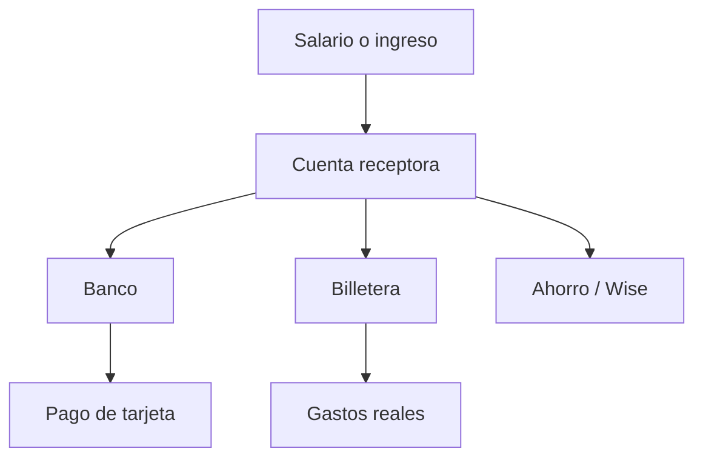
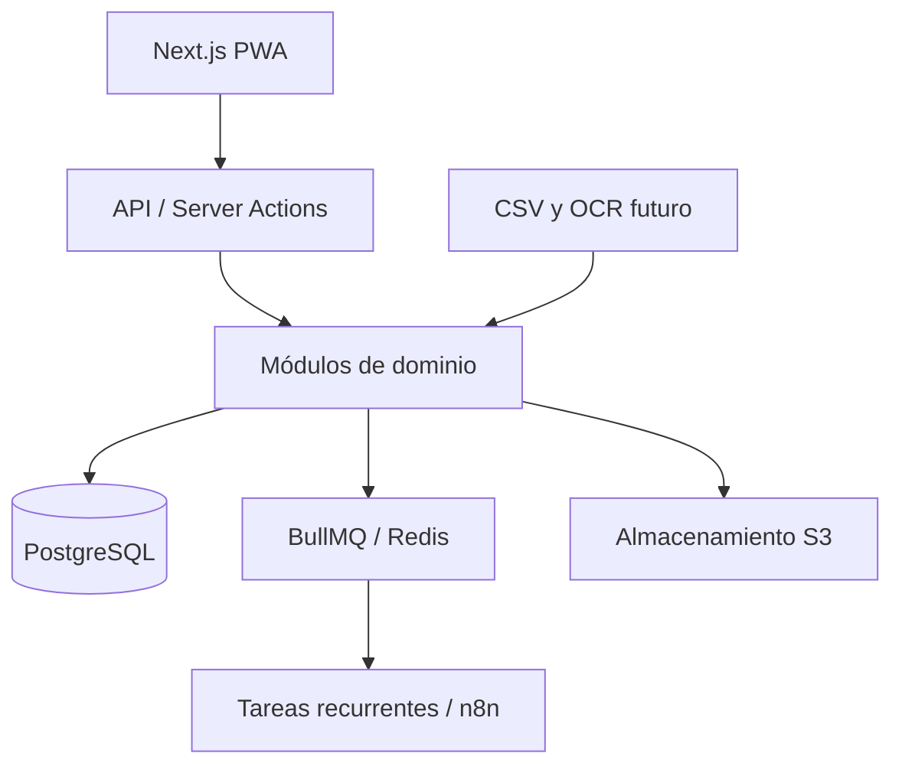

# RutaSaldo

> Controla cómo se mueve tu dinero entre bancos, billeteras, tarjetas y deudas, sin contar dos veces las transferencias.

RutaSaldo es una aplicación web instalable (PWA) de finanzas personales, pensada inicialmente para Colombia y Latinoamérica. Su objetivo es responder una pregunta sencilla:

> **¿Cuánto dinero tengo realmente disponible después de considerar mis cuentas, tarjetas, deudas y próximos pagos?**

La aplicación está diseñada para personas que reciben dinero en una cuenta y luego lo distribuyen entre bancos, billeteras digitales, tarjetas de crédito, cuentas internacionales y otras obligaciones.

## El problema

Las aplicaciones tradicionales suelen tratar cada movimiento como un ingreso o un gasto. Esto genera información incorrecta cuando una persona mueve dinero entre sus propias cuentas.

Por ejemplo:

```text
Salario → RappiPay → Bancolombia → Pago de tarjeta
                    → Nequi       → Gastos diarios
                    → Wise        → Ahorro
```

- Pasar dinero de RappiPay a Bancolombia no es un gasto.
- Recibirlo en Bancolombia no es un nuevo ingreso.
- Pagar una tarjeta no debe duplicar el gasto de la compra original.
- Una compra a cuotas debe afectar la deuda y los pagos futuros de forma correcta.

RutaSaldo tendrá como núcleo la **conciliación de transferencias** y el cálculo del **saldo realmente disponible**.

## Features

### MVP

- Registro e inicio de sesión.
- Espacios financieros personales y, a futuro, compartidos.
- Cuentas bancarias, efectivo y billeteras digitales.
- Soporte para Nequi, Daviplata, RappiPay, Bancolombia y otras entidades.
- Cuentas en varias monedas, incluyendo COP y cuentas como Wise.
- Registro de ingresos, gastos y transferencias.
- Transferencias enlazadas entre cuentas propias.
- Prevención de ingresos y gastos duplicados.
- Categorías, etiquetas y notas.
- Tarjetas de crédito con cupo, saldo, fecha de corte y fecha de pago.
- Compras a una o varias cuotas.
- Pagos de tarjetas sin duplicar el gasto original.
- Deudas y créditos con saldo, tasa, cuota y vencimiento.
- Movimientos recurrentes.
- Presupuestos por categoría.
- Metas y bolsillos de ahorro.
- Importación y exportación mediante CSV.
- Dashboard mensual y responsive.
- PWA instalable.

### Indicadores principales

- Dinero total en cuentas y billeteras.
- Deuda total.
- Patrimonio neto.
- Obligaciones antes del siguiente ingreso.
- Saldo realmente disponible.
- Dinero disponible por día hasta la próxima quincena.
- Próximos pagos.
- Cumplimiento del presupuesto.

### Fases posteriores

- Conciliación sugerida automáticamente.
- OCR de comprobantes y extractos.
- Automatizaciones mediante n8n.
- Asistente financiero con IA.
- Reglas automáticas de categorización.
- Finanzas compartidas para parejas o familias.
- Sincronización offline con IndexedDB.
- Integraciones bancarias cuando sean técnica y legalmente viables.
- Portafolio de inversiones.
- Predicciones de flujo de caja.

## Ruta del dinero

La función diferenciadora será una vista que permita seguir el origen y destino del dinero:



Esta vista permitirá distinguir:

- Ingresos reales.
- Gastos reales.
- Transferencias entre cuentas propias.
- Pagos de deuda.
- Dinero reservado.
- Movimientos posiblemente duplicados.

## Arquitectura propuesta

Se propone comenzar con un **monolito modular**. Esta decisión reduce la complejidad operativa del MVP y mantiene límites de dominio que permitirán separar servicios más adelante si el producto lo necesita.



### Stack sugerido

| Capa | Tecnología | Uso |
|---|---|---|
| Aplicación | Next.js + TypeScript | PWA, interfaz y API inicial |
| UI | Tailwind CSS + shadcn/ui | Componentes accesibles y reutilizables |
| Base de datos | PostgreSQL | Persistencia transaccional |
| ORM | Drizzle o Prisma | Esquema, migraciones y consultas |
| Autenticación | Better Auth | Sesiones y proveedores de acceso |
| Validación | Zod | Contratos y formularios |
| Gráficas | Recharts | Dashboard y reportes |
| Jobs | BullMQ + Redis | Recurrencias, importaciones y procesos en segundo plano |
| Archivos | S3 compatible | Extractos y comprobantes |
| Pruebas | Vitest + Playwright | Pruebas unitarias, integración y end-to-end |
| Desarrollo | Docker Compose | PostgreSQL y Redis locales |

### Módulos de dominio

```text
src/
├── app/                 # Rutas, layouts y páginas
├── modules/
│   ├── auth/            # Usuarios y sesiones
│   ├── workspaces/      # Finanzas personales o compartidas
│   ├── accounts/        # Bancos, billeteras, efectivo y Wise
│   ├── transactions/    # Ingresos, gastos, splits y transferencias
│   ├── reconciliation/  # Detección y enlace de movimientos
│   ├── credit-cards/    # Cupos, cortes, pagos y cuotas
│   ├── debts/           # Créditos y obligaciones
│   ├── budgets/         # Presupuestos y periodos
│   ├── goals/           # Metas y bolsillos
│   ├── recurring/       # Movimientos recurrentes
│   ├── imports/         # CSV y futuros extractos
│   └── dashboard/       # Métricas y proyecciones
├── components/          # Componentes compartidos
├── db/                  # Esquema, migraciones y seeds
└── lib/                 # Utilidades e integraciones
```

## Modelo de dominio inicial

| Entidad | Responsabilidad |
|---|---|
| `User` | Identidad del usuario |
| `Workspace` | Contenedor de las finanzas |
| `WorkspaceMember` | Acceso personal o compartido |
| `Account` | Banco, billetera, efectivo o cuenta internacional |
| `CreditCard` | Cupo, deuda, corte y fecha de pago |
| `Transaction` | Movimiento financiero |
| `TransactionSplit` | División de un movimiento entre categorías |
| `Transfer` | Relación entre salida y entrada de cuentas propias |
| `InstallmentPlan` | Compra y calendario de cuotas |
| `Debt` | Crédito u obligación externa |
| `Category` | Clasificación de ingresos y gastos |
| `Tag` | Clasificación flexible |
| `Budget` | Límite por categoría y periodo |
| `SavingsGoal` | Meta o dinero reservado |
| `RecurringTransaction` | Movimiento programado |
| `ImportJob` | Importación y conciliación de archivos |
| `Attachment` | Comprobante o extracto asociado |

### Reglas financieras importantes

- Los importes deben almacenarse como enteros en la unidad monetaria mínima o como `decimal`; nunca como `float`.
- Una transferencia enlaza dos movimientos y no afecta ingresos ni gastos.
- El gasto de una tarjeta ocurre al registrar la compra, no al pagar la tarjeta.
- Un pago de tarjeta reduce una cuenta de activos y la deuda de la tarjeta.
- Cada cuenta conserva su moneda original.
- Las conversiones deben guardar monto de origen, monto de destino y tasa aplicada.
- Los balances calculados deben poder reconstruirse desde el historial de movimientos.
- Toda operación financiera sensible debe ejecutarse dentro de una transacción de base de datos.

## Roadmap

### Fase 1 — Fundamentos

- Autenticación.
- Workspaces.
- Cuentas y saldos iniciales.
- Ingresos, gastos y categorías.
- Dashboard básico.

### Fase 2 — Movimiento real del dinero

- Transferencias enlazadas.
- Conciliación manual.
- Tarjetas de crédito.
- Compras a cuotas.
- Deudas y próximos pagos.

### Fase 3 — Planeación

- Presupuestos.
- Quincenas y ciclos de ingreso personalizados.
- Bolsillos y metas.
- Disponible real y disponible diario.
- Movimientos recurrentes.

### Fase 4 — Automatización

- Importación CSV.
- Reglas de categorización.
- Detección de duplicados.
- OCR.
- Flujos con n8n e IA.

## Proyectos de referencia

Estos repositorios sirven como referencia de producto, arquitectura y experiencia de usuario. La intención es estudiar sus decisiones y construir una implementación propia.

| Proyecto | Referencia principal | Qué estudiar |
|---|---|---|
| [Actual Budget](https://github.com/actualbudget/actual) | Presupuestos y enfoque local-first | Reglas, recurrencias, sincronización y experiencia de presupuesto |
| [Firefly III](https://github.com/firefly-iii/firefly-iii) | Modelo financiero maduro | Cuentas, transacciones, transferencias, categorías y API |
| [Maybe / Sure](https://github.com/we-promise/sure) | Patrimonio y dashboard | Presentación de activos, deudas y patrimonio neto |
| [Ghostfolio](https://github.com/ghostfolio/ghostfolio) | Inversiones | Portafolio, asignación de activos y métricas patrimoniales |
| [Cashew](https://github.com/jameskokoska/Cashew) | Experiencia móvil | Registro rápido, presupuestos y objetivos |
| [Monekin](https://github.com/enrique-lozano/Monekin) | Offline y múltiples monedas | UX móvil, monedas, deudas y propiedades |
| [ezBookkeeping](https://github.com/mayswind/ezbookkeeping) | Aplicación self-hosted ligera | Rendimiento, despliegue y simplicidad operativa |
| [Ivy Wallet](https://github.com/Ivy-Apps/ivy-wallet) | Registro manual en Android | Interacciones rápidas y diseño de movimientos |
| [Awesome Personal Finance](https://github.com/finwiki/awesome-personal-finance) | Catálogo de soluciones | Investigación de herramientas y estándares existentes |

### Estrategia para no empezar desde cero

- Usar shadcn/ui para componentes base.
- Usar Better Auth para autenticación.
- Usar Recharts para visualizaciones.
- Usar una librería estable para lectura y validación de CSV.
- Adoptar patrones del modelo de transacciones de Firefly III.
- Estudiar el motor de presupuestos y reglas de Actual Budget.
- Tomar como referencia la experiencia móvil de Cashew.
- Reservar la lógica propia para conciliación, quincenas, cuotas, bolsillos y saldo disponible real.

> [!IMPORTANT]
> Antes de reutilizar código, revisa la licencia de cada proyecto y sus dependencias. Algunos referentes utilizan GPL o AGPL y pueden exigir que las obras derivadas distribuidas o desplegadas publiquen su código fuente. Inspirarse en flujos y decisiones de diseño no equivale a copiar su implementación.

## Principios del producto

- **Claridad:** cada cifra debe poder explicarse desde sus movimientos.
- **Sin duplicados:** mover dinero no debe alterar los ingresos ni los gastos.
- **Privacidad:** los datos financieros pertenecen al usuario.
- **Local primero:** COP, quincenas, cuotas y billeteras latinoamericanas son casos principales.
- **Progresivo:** el registro manual y CSV deben funcionar antes de integrar bancos o IA.
- **Portable:** el usuario debe poder exportar su información.

## Estado

**Fase 1 disponible como prototipo funcional.**

- Acceso de demostración y workspace personal.
- Cuentas bancarias, billeteras y efectivo con saldo inicial.
- Registro de ingresos y gastos.
- Categorías financieras.
- Dashboard con saldos, totales y distribución de gastos.
- Persistencia privada en el navegador.
- Interfaz responsive y manifiesto PWA.

La persistencia local permite validar los flujos sin configurar infraestructura. Antes de usar
datos financieros reales se reemplazará por PostgreSQL y autenticación segura con Better Auth.

### Ejecutar localmente

Requiere Node.js 20 o superior.

```bash
npm install
npm run dev
```

Abre `http://localhost:3000`. La pantalla de acceso incluye credenciales de demostración.

```bash
npm run lint
npm test
npm run build
```

## Contribuciones

Las propuestas, discusiones y pull requests son bienvenidos. Antes de implementar una funcionalidad grande, abre un issue describiendo el problema, el caso de uso y el comportamiento esperado.

## Licencia

La licencia del proyecto está por definir. Para un proyecto público que permita uso y contribuciones amplias, se puede considerar **Apache-2.0** o **MIT**. La elección debe hacerse antes de aceptar contribuciones externas.
